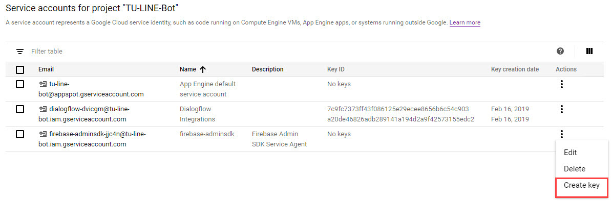

An intelligent LINE chatbot for people at Thammasat University.

1. Register Heroku, Google Cloud Platform, Dialogflow, Firebase, and LINE Developers
2. Use the command git clone https://github.com/gamertense/react-TUbus-tracking
3. Use the service account key generated from Google Platform and replace tu-bot-serviceAccountKey.json inside firestore directory.

4. Deploy to Heroku
5. Navigate to LINE Developers website
5. Create a new provider and channel
6. Copy the channel access token shown on LINE developer console and paste in .env file in project directory
7. Edit the rest keys in .env file according to your recently created Dialogflow ID and Firebase ID